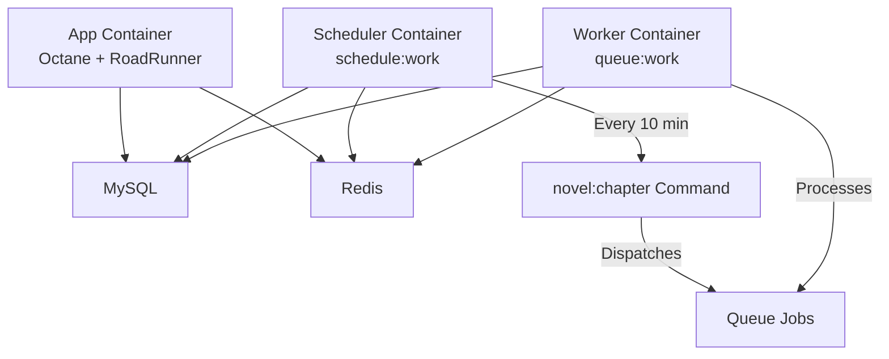

# Novarr Docker Deployment Guide

This guide covers deploying Novarr using Docker, with specific instructions for Unraid servers.

## Overview

Novarr runs on a modern Docker stack with the following services:

| Service | Image | Purpose |
|---------|-------|---------|
| **app-blue** | Custom (Laravel + Octane) | Blue environment app server (active or standby) |
| **app-green** | Custom (Laravel + Octane) | Green environment app server (active or standby) |
| **mysql** | mysql:8.0 | Primary database storage |
| **redis** | redis:7-alpine | Cache, sessions, and queue storage |
| **nginx** | nginx:alpine | Reverse proxy with dynamic upstream switching |
| **scheduler** | Custom (Laravel) | Runs scheduled tasks via `schedule:work` |
| **worker** | Custom (Laravel) | Processes queue jobs via `queue:work redis` |

### Architecture (Blue-Green)

```
                    ┌─────────────────────────────────────┐
                    │           User/Browser              │
                    └─────────────┬───────────────────────┘
                                  │ HTTP/HTTPS
                    ┌─────────────▼───────────────────────┐
                    │         Nginx (:80/:443)            │
                    │   (Dynamic Upstream Switching)      │
                    │      upstream.conf → BLUE/GREEN     │
                    └─────────────┬───────────────────────┘
                                  │ Proxy (configurable)
                    ┌─────────────┴───────────────────────┐
                    │                                     │
         ┌──────────▼────────┐             ┌──────────────▼───────┐
         │  App BLUE (:8000) │             │  App GREEN (:8000)   │
         │ (Active/Standby)  │             │  (Active/Standby)    │
         │ Octane+RoadRunner │             │  Octane+RoadRunner   │
         └─────┬──────┬──────┘             └─────┬──────┬─────────┘
               │      │                          │      │
               │      └──────────┬───────────────┘      │
               │                 │                      │
    ┌──────────▼────┐  ┌─────────▼─────────┐  ┌────────▼────────┐
    │ MySQL (:3306) │  │  Redis (:6379)    │  │ Shared Volumes  │
    │  (Database)   │  │  (Cache/Queue)    │  │ (storage, logs) │
    └───────────────┘  └───────────────────┘  └─────────────────┘

    ┌─────────────────────────────────────────────────────────────┐
    │  Scheduler Container          │  Worker Container           │
    │  (schedule:work)              │  (queue:work redis)         │
    │  Runs tasks every minute      │  Processes queued jobs      │
    └─────────────────────────────────────────────────────────────┘
```

### Scheduler & Queue Workers Architecture



**How it works:**
- **Scheduler** runs Laravel's `schedule:work` command, which executes scheduled tasks (like `novel:chapter`) every 10 minutes
- **Worker** processes jobs from the Redis queue using `queue:work`
- **Supervisor** (optional) manages process lifecycle with automatic restarts
- Separate containers allow independent scaling of workers

### Deployment Flow

```
┌──────────┐     ┌──────────┐     ┌──────────┐     ┌──────────┐
│  Build   │────▶│  Start   │────▶│  Health  │────▶│  Switch  │
│  Image   │     │  GREEN   │     │  Check   │     │  Traffic │
└──────────┘     └──────────┘     └──────────┘     └────┬─────┘
                                                        │
┌──────────┐     ┌──────────┐     ┌──────────┐         │
│ Cleanup  │◀────│  Drain   │◀────│  Reload  │◀────────┘
│   BLUE   │     │  BLUE    │     │  Nginx   │
└──────────┘     └──────────┘     └──────────┘
```

## Prerequisites

### General Requirements
- Docker Engine 20.10+
- Docker Compose 2.0+
- At least 2GB RAM available
- 10GB disk space (more for media storage)

### Unraid Requirements
- Unraid 6.9+
- Community Applications plugin installed
- Docker Compose Manager plugin (recommended) OR use command line

### Port Requirements

| Port | Service | Required |
|------|---------|----------|
| 80 | Nginx (HTTP) | Yes |
| 443 | Nginx (HTTPS) | Optional |
| 3306 | MySQL | Optional (internal only recommended) |
| 6379 | Redis | Optional (internal only recommended) |
| 8000 | App (direct) | Optional (for debugging) |

## Initial Setup

### 1. Clone or Copy Files

```bash
# Clone the repository
git clone https://github.com/your-repo/novarr.git
cd novarr

# Or copy files to your deployment directory
```

### 2. Configure Environment

```bash
# Copy the example environment file
cp .env.example .env

# Generate application key
docker-compose run --rm app php artisan key:generate
```

### 3. Set Required Variables

Edit `.env` and set these required values:

```env
# Application
APP_KEY=           # Generated in step 2
APP_URL=http://your-domain.com

# Database (use strong passwords!)
DB_PASSWORD=your_secure_password_here
DB_ROOT_PASSWORD=your_root_password_here
```

### 4. Create Storage Directories

```bash
# Ensure storage directories exist with proper permissions
mkdir -p storage/app/public storage/framework/{cache,sessions,views} storage/logs
mkdir -p bootstrap/cache public/storage

# Set permissions (adjust user:group as needed)
chmod -R 775 storage bootstrap/cache
```

### 5. Start Services

```bash
# Start all services in detached mode
docker-compose up -d

# Wait for services to be healthy
docker-compose ps

# Run database migrations
docker-compose run --rm app php artisan migrate

# Create storage symlink
docker-compose run --rm app php artisan storage:link
```

> **Note:** When using `make deploy`, the Voyager menu items (including Tools > Commands) are automatically seeded after migrations. No manual intervention is required for the admin menu to appear.

### 6. Verify Installation

```bash
# Check health endpoints
curl http://localhost/api/health

# View logs
docker-compose logs -f app
```

## Unraid Deployment

### Method 1: Docker Compose Manager (Recommended)

1. Install "Docker Compose Manager" from Community Applications
2. Create a new stack named "novarr"
3. Paste the contents of `docker-compose.yml`
4. Add environment variables in the UI
5. Deploy the stack

### Method 2: Command Line

1. SSH into your Unraid server

2. Create application directory:
```bash
mkdir -p /mnt/user/appdata/novarr
cd /mnt/user/appdata/novarr
```

3. Copy project files or clone repository

4. Set up environment:
```bash
cp .env.example .env
# Edit .env with your settings
nano .env
```

5. Start the stack:
```bash
docker-compose up -d
```

### Unraid-Specific Configuration

Update your `.env` for Unraid:

```env
# Use Unraid-friendly paths
APP_URL=http://your-unraid-ip

# If using Nginx Proxy Manager, set your domain
APP_URL=https://novarr.yourdomain.com
```

### Reverse Proxy Setup (Nginx Proxy Manager)

If using Nginx Proxy Manager on Unraid:

1. Add a new proxy host
2. Set domain name (e.g., `novarr.yourdomain.com`)
3. Forward to: `novarr-nginx` on port `80`
4. Enable SSL if desired

## Running the Application

### Basic Commands

| Action | Command |
|--------|---------|
| Start all services | `docker-compose up -d` |
| Stop all services | `docker-compose down` |
| Restart a service | `docker-compose restart [service]` |
| View logs | `docker-compose logs -f [service]` |
| View all logs | `docker-compose logs -f` |
| Check status | `docker-compose ps` |
| Enter app shell | `docker-compose exec app sh` |

### Development Mode

For local development, use the override file:

```bash
docker-compose -f docker-compose.yml -f docker-compose.override.yml up -d
```

This enables:
- Code hot-reloading with `--watch`
- Full codebase mounted as volume
- `APP_DEBUG=true`
- Automatic `composer install` on startup

## Updating the Application

### Zero-Downtime Blue-Green Deployment (Recommended)

Novarr uses blue-green deployment for true zero-downtime updates. This strategy ensures:
- **No 502/503 errors** during updates
- **< 5 seconds** total disruption (for nginx reload)
- **Automatic rollback** on failure
- **Pre-flight health checks** before traffic switch

#### How It Works

```
┌─────────────────────────────────────────────────────────────────┐
│                    Blue-Green Deployment Flow                    │
└─────────────────────────────────────────────────────────────────┘

1. PREPARATION
   ├── Pull latest code
   ├── Backup database
   └── Build new Docker image

2. START NEW CONTAINER
   ├── Start GREEN container (if BLUE is active)
   ├── Wait for health checks
   └── Run smoke tests

3. DATABASE MIGRATIONS & MENU SEEDING
   ├── Run migrations on NEW container
   ├── Seed Voyager menu items (idempotent)
   └── (Maintenance mode only for schema-breaking changes)

4. TRAFFIC SWITCH
   ├── Update nginx upstream.conf → point to GREEN
   └── Reload nginx (<1s, graceful)

5. CLEANUP
   ├── Drain connections from BLUE (5s)
   ├── Stop BLUE container
   └── Update deployment state

6. VERIFICATION
   └── Run final health checks
```

#### Quick Commands

```bash
# Zero-downtime update (recommended)
make update

# Preview what would happen
make update-dry-run

# Force update (skip git checks)
make update-force

# View current deployment state
make deployment-status

# Rollback to previous deployment
make rollback
```

#### Manual Update

```bash
# Standard zero-downtime update
./docker-update.sh

# With options
./docker-update.sh --skip-git --verbose

# Dry run (preview only)
./docker-update.sh --dry-run
```

#### Available Options

| Option | Description |
|--------|-------------|
| `--dry-run` | Preview changes without executing |
| `--skip-git` | Skip git pull |
| `--skip-backup` | Skip database backup |
| `--skip-confirm` | Skip confirmation prompt |
| `--skip-migrations` | Skip running migrations |
| `--force` | Force update even with uncommitted changes |
| `--verbose` | Enable detailed debug output |
| `--rollback` | Rollback to previous deployment |

### Deployment State

The deployment state is tracked in `.deployment-state`:

```bash
# View current state
cat .deployment-state

# Or use make command
make deployment-status
```

Example output:
```
DEPLOYMENT_ACTIVE_COLOR=blue
DEPLOYMENT_ACTIVE_TAG=20241215-143022
DEPLOYMENT_TIMESTAMP=1702651822
```

### Smoke Tests

After deployment, run smoke tests to verify everything works:

```bash
# Test current deployment
make smoke-test

# Verbose output
make smoke-test-verbose

# Test specific color
make smoke-test-blue
make smoke-test-green
```

### Rollback

If something goes wrong, rollback is quick and easy:

```bash
# Automatic rollback
make rollback

# Or manually
./docker-update.sh --rollback
```

This will:
1. Start the previous container
2. Wait for health checks
3. Switch nginx traffic back
4. Stop the failed container

### Legacy Update Method

For simple updates without blue-green (not recommended for production):

| Step | Command | Description |
|------|---------|-------------|
| 1 | `git pull` | Get latest code |
| 2 | `docker-compose build --no-cache app` | Rebuild app image |
| 3 | `docker-compose run --rm app php artisan migrate` | Run migrations |
| 4 | `docker-compose run --rm app php artisan config:cache` | Cache config |
| 5 | `docker-compose run --rm app php artisan route:cache` | Cache routes |
| 6 | `docker-compose run --rm app php artisan view:cache` | Cache views |
| 7 | `docker-compose up -d` | Restart services |

## Environment Variables Reference

### Required Variables

| Variable | Description |
|----------|-------------|
| `APP_KEY` | Application encryption key (auto-generated) |
| `APP_URL` | Public URL of your application |
| `DB_PASSWORD` | MySQL user password |
| `DB_ROOT_PASSWORD` | MySQL root password |

### Optional Variables

| Variable | Default | Description |
|----------|---------|-------------|
| `APP_ENV` | production | Environment (production/local) |
| `APP_DEBUG` | false | Enable debug mode |
| `APP_TIMEZONE` | UTC | Application timezone |
| `DB_HOST` | mysql | Database hostname |
| `DB_PORT` | 3306 | Database port |
| `DB_DATABASE` | novarr | Database name |
| `DB_USERNAME` | novarr_user | Database user |
| `REDIS_HOST` | redis | Redis hostname |
| `REDIS_PORT` | 6379 | Redis port |
| `CACHE_DRIVER` | redis | Cache driver |
| `SESSION_DRIVER` | redis | Session driver |
| `QUEUE_CONNECTION` | redis | Queue driver |
| `LOG_CHANNEL` | stack | Logging channel |
| `LOG_LEVEL` | warning | Minimum log level |

## Volume Mounts & Data Persistence

### Volumes Overview

| Volume/Path | Container Path | Purpose |
|-------------|----------------|---------|
| `mysql-data` | /var/lib/mysql | Database files (persistent) |
| `redis-data` | /data | Redis persistence |
| `./storage` | /var/www/html/storage | App uploads, logs, cache |
| `./bootstrap/cache` | /var/www/html/bootstrap/cache | Laravel bootstrap cache |
| `./public/storage` | /var/www/html/public/storage | Public storage symlink |

### Storage Directory Structure

```
storage/
├── app/
│   ├── public/          # Publicly accessible uploads
│   └── private/         # Private application files
├── framework/
│   ├── cache/           # Application cache
│   ├── sessions/        # User sessions
│   └── views/           # Compiled Blade views
└── logs/
    └── laravel.log      # Application logs
```

## Scheduler & Worker Management

### Viewing Logs

```bash
# View scheduler logs
make logs-scheduler

# View worker logs
make logs-worker

# View all logs
make logs
```

### Queue Management

```bash
# Restart queue workers (workers finish current job then restart)
make queue-restart

# View failed jobs
make queue-failed

# Retry all failed jobs
make queue-retry

# Clear all queued jobs
make queue-clear

# Check queue health
make queue-health
```

### Queue Configuration

The application uses Redis for queue processing by default:

| Variable | Default | Description |
|----------|---------|-------------|
| `QUEUE_CONNECTION` | redis | Queue driver (redis, sync, database) |
| `QUEUE_FAILED_DRIVER` | database | Where to store failed jobs |

Worker options (configured in docker-compose.yml):
- `--sleep=3`: Wait 3 seconds between job checks when queue is empty
- `--tries=3`: Retry failed jobs up to 3 times
- `--max-time=3600`: Restart worker after 1 hour to prevent memory leaks

### Scaling Workers

To increase the number of queue workers, modify `docker-compose.yml`:

```yaml
worker:
  deploy:
    replicas: 3  # Run 3 worker instances
```

Or use Docker Compose scale:
```bash
docker-compose up -d --scale worker=3
```

### Supervisor Variant (Single Container)

For resource-constrained environments (like Unraid with limited container slots), use the supervisor variant which runs Octane, workers, and scheduler in a single container:

```bash
# Start with supervisor variant
make up-supervisor

# Stop supervisor variant
make down-supervisor

# Check supervisor status
make supervisor-status

# Restart specific processes
make supervisor-restart-workers
make supervisor-restart-scheduler
make supervisor-restart-octane

# View supervisor logs
make supervisor-logs
make supervisor-logs-workers
make supervisor-logs-scheduler
```

Configure the number of workers via environment variable:
```env
SUPERVISOR_WORKER_PROCESSES=2
```

## Health Checks & Monitoring

### Health Check Endpoints

| Endpoint | Description | Response |
|----------|-------------|----------|
| `/api/health` | Full health check (DB + Redis + Storage) | JSON with all service statuses |
| `/api/health/db` | Database connectivity only | JSON with DB status |
| `/api/health/cache` | Redis connectivity only | JSON with Redis status |
| `/api/ping` | Simple liveness probe | Plain text "pong" |

### Example Health Response

```json
{
  "status": "healthy",
  "timestamp": "2024-01-15T10:30:00+00:00",
  "app": "Novarr",
  "version": "1.0.0",
  "services": {
    "database": {
      "status": "healthy",
      "latency_ms": 2.5,
      "connection": "mysql"
    },
    "redis": {
      "status": "healthy",
      "latency_ms": 0.8
    },
    "storage": {
      "status": "healthy",
      "path": "/var/www/html/storage"
    }
  }
}
```

### Docker Health Check Status

```bash
# View health status of all containers
docker-compose ps

# Check specific container health
docker inspect --format='{{.State.Health.Status}}' novarr-app
```

## Troubleshooting

### Permission Errors on Storage

**Symptom:** "Permission denied" errors when writing to storage

**Solution:**
```bash
# Fix permissions on host
chmod -R 775 storage bootstrap/cache
chown -R www-data:www-data storage bootstrap/cache

# Or from within container
docker-compose exec app chown -R www-data:www-data storage bootstrap/cache
```

### Database Connection Failures

**Symptom:** "Connection refused" or "Access denied" errors

**Solutions:**
1. Ensure MySQL is healthy: `docker-compose ps mysql`
2. Verify credentials in `.env` match `docker-compose.yml`
3. Wait for MySQL to fully initialize (check logs)
4. Try connecting manually: `docker-compose exec mysql mysql -u novarr_user -p`

### Redis Connection Issues

**Symptom:** "Connection refused" to Redis

**Solutions:**
1. Check Redis is running: `docker-compose ps redis`
2. Verify `REDIS_HOST=redis` in `.env`
3. Test connection: `docker-compose exec redis redis-cli ping`

### Port Conflicts on Unraid

**Symptom:** Container won't start, port already in use

**Solutions:**
1. Check for conflicting services: `docker ps -a`
2. Change port mappings in `docker-compose.yml`:
```yaml
ports:
  - "8080:80"  # Use 8080 instead of 80
```

### Octane/RoadRunner Not Starting

**Symptom:** App container keeps restarting

**Solutions:**
1. Check logs: `docker-compose logs app`
2. Verify PHP extensions are installed
3. Check RoadRunner config: `docker-compose exec app cat .rr.yaml`
4. Try running manually: `docker-compose exec app php artisan octane:start`

### Storage Symlink Not Working

**Symptom:** Uploaded files not accessible via web

**Solution:**
```bash
# Recreate symlink
docker-compose exec app php artisan storage:link

# Verify symlink exists
docker-compose exec app ls -la public/storage
```

## Backup & Restore

### Backup MySQL Database

```bash
# Create backup
docker-compose exec mysql mysqldump -u root -p${DB_ROOT_PASSWORD} novarr > backup_$(date +%Y%m%d).sql

# Or using docker directly
docker exec novarr-mysql mysqldump -u root -p novarr > backup.sql
```

### Restore MySQL Database

```bash
# Restore from backup
docker-compose exec -T mysql mysql -u root -p${DB_ROOT_PASSWORD} novarr < backup.sql

# Or using docker directly
docker exec -i novarr-mysql mysql -u root -p novarr < backup.sql
```

### Backup Storage Directory

```bash
# Create compressed backup
tar -czf storage_backup_$(date +%Y%m%d).tar.gz storage/

# Backup specific directories
tar -czf uploads_backup.tar.gz storage/app/public/
```

### Backup .env File

```bash
# Always backup your .env file (contains secrets!)
cp .env .env.backup.$(date +%Y%m%d)
```

### Full Backup Script

```bash
#!/bin/bash
BACKUP_DIR="./backups/$(date +%Y%m%d)"
mkdir -p "$BACKUP_DIR"

# Backup database
docker-compose exec -T mysql mysqldump -u root -p${DB_ROOT_PASSWORD} novarr > "$BACKUP_DIR/database.sql"

# Backup storage
tar -czf "$BACKUP_DIR/storage.tar.gz" storage/

# Backup .env
cp .env "$BACKUP_DIR/.env"

echo "Backup completed: $BACKUP_DIR"
```

## Migrating from Development to Production

This section covers migrating an existing Novarr development environment to a production server (including Unraid).

### Overview

The migration process exports your development database and storage files, then imports them into your production environment. This is useful when:
- Moving from local development to a production server
- Setting up a new Unraid server with existing novel data
- Restoring a backup to a new installation

### Prerequisites

- Access to your development environment with MySQL client tools
- SSH access to your production server
- Sufficient disk space on both environments
- The `./scripts/migrate-from-dev.sh` script

### Step 1: Export from Development

On your development machine, run the migration export script:

```bash
cd /path/to/novarr
./scripts/migrate-from-dev.sh
```

This will:
1. Read database credentials from your `.env` file
2. Create a MySQL dump of your database
3. Archive the `storage/` directory containing novels and EPUBs
4. Copy your `.env` file for reference
5. Generate migration metadata

**Options:**
```bash
./scripts/migrate-from-dev.sh --help          # Show help
./scripts/migrate-from-dev.sh -y              # Skip confirmations
./scripts/migrate-from-dev.sh --skip-storage  # Only export database
./scripts/migrate-from-dev.sh --skip-db       # Only export storage
```

**Output files:**
```
migrate/
├── dump.sql              # Database dump
├── storage.tar.gz        # Archived storage directory
├── .env.backup           # Copy of .env for reference
└── migration-info.txt    # Export metadata
```

### Step 2: Transfer to Production

Copy the `migrate/` directory to your production server:

```bash
# Using scp
scp -r ./migrate/ root@your-unraid-ip:/mnt/user/appdata/novarr/

# Using rsync (recommended for large files)
rsync -avz --progress ./migrate/ root@your-unraid-ip:/mnt/user/appdata/novarr/migrate/
```

### Step 3: Import on Production

On your production server, run the deployment with migration mode:

```bash
cd /mnt/user/appdata/novarr
./docker-deploy.sh --migrate
```

Or if the `./migrate/` directory exists with `dump.sql` or `storage.tar.gz`, the script will automatically detect and import them during a normal deployment:

```bash
./docker-deploy.sh
```

**What happens during import:**
1. Database dump is imported into MySQL
2. Storage archive is extracted to `./storage/`
3. Storage permissions are fixed
4. Migration files are moved to `./migrate/imported-TIMESTAMP/` for backup
5. Laravel migrations run (to apply any schema updates)
6. Voyager menus are seeded

### Manual Import (Alternative)

If you need to import manually:

```bash
# Import database
docker exec -i novarr-mysql mysql -u root -p$DB_ROOT_PASSWORD novarr < migrate/dump.sql

# Extract storage
tar xzf migrate/storage.tar.gz -C .

# Fix permissions
chmod -R 775 storage
docker exec novarr-app-blue chown -R www-data:www-data /var/www/html/storage

# Run migrations
docker exec novarr-app-blue php artisan migrate --force
```

### Verification

After migration, verify your data:

1. **Access Voyager Admin Panel**: Navigate to `/admin` and log in
2. **Check Novels**: Browse to `/admin/novels` and verify your novels are listed
3. **Check Chapters**: Verify chapter content is accessible
4. **Check EPUBs**: Verify generated EPUBs are downloadable
5. **Check Storage**: Ensure cover images and uploaded files are visible

```bash
# List novels count
docker exec novarr-app-blue php artisan tinker --execute="echo App\\Novel::count();"

# Check storage directory
ls -la storage/app/
```

### Troubleshooting

**Database import fails:**
```bash
# Check MySQL is running
docker exec novarr-mysql mysqladmin ping -h localhost -u root -p$DB_ROOT_PASSWORD

# Check for errors in import
docker exec -i novarr-mysql mysql -u root -p$DB_ROOT_PASSWORD novarr < migrate/dump.sql 2>&1

# View MySQL logs
docker logs novarr-mysql
```

**Permission errors on storage:**
```bash
# Fix permissions inside container
docker exec novarr-app-blue chmod -R 775 /var/www/html/storage
docker exec novarr-app-blue chown -R www-data:www-data /var/www/html/storage

# On host
sudo chmod -R 775 storage
sudo chown -R 1000:1000 storage  # Adjust UID/GID as needed
```

**Storage paths don't match:**
The storage archive is created relative to the project root. If your production paths differ, extract manually and move files:

```bash
tar xzf migrate/storage.tar.gz
mv storage/* /your/actual/storage/path/
```

**Missing novels after import:**
```bash
# Clear caches
docker exec novarr-app-blue php artisan cache:clear
docker exec novarr-app-blue php artisan config:clear

# Verify database has data
docker exec novarr-app-blue php artisan tinker --execute="dump(DB::table('novels')->count());"
```

## Development Workflow

The `docker-compose.override.yml` file is automatically loaded during development:

### Features Enabled in Development

- **Code Hot-Reloading**: Changes to PHP files trigger automatic restart
- **Full Volume Mount**: Entire codebase mounted for live editing
- **Debug Mode**: `APP_DEBUG=true` for detailed error messages
- **Composer Install**: Runs on container startup

### Switching Between Environments

```bash
# Development (with override)
docker-compose up -d

# Production (without override)
docker-compose -f docker-compose.yml up -d

# Or rename the override file
mv docker-compose.override.yml docker-compose.override.yml.disabled
```

### Running Artisan Commands

```bash
# Run any artisan command
docker-compose exec app php artisan [command]

# Examples
docker-compose exec app php artisan migrate
docker-compose exec app php artisan queue:work
docker-compose exec app php artisan tinker
```

### Running Tests

```bash
# Run PHPUnit tests
docker-compose exec app php artisan test

# Run specific test
docker-compose exec app php artisan test --filter=TestClassName
```

## Security Recommendations

1. **Never expose MySQL/Redis ports** in production
   - Remove port mappings or bind to localhost only

2. **Use strong passwords** for DB_PASSWORD and DB_ROOT_PASSWORD

3. **Enable HTTPS** via reverse proxy (Nginx Proxy Manager, Traefik, etc.)

4. **Keep images updated**:
   ```bash
   docker-compose pull
   docker-compose build --no-cache
   ```

5. **Backup .env file** and keep it secure (contains secrets)

6. **Use environment-specific configs** - don't commit production `.env`

## Voyager Admin Panel

Novarr includes the Voyager admin panel for managing novels and chapters through a web interface.

### Accessing the Admin Panel

After installation, access the admin panel at:
```
http://your-domain/admin
```

### Initial Setup

After first deployment, run Voyager installation:

```bash
# Install Voyager
docker-compose exec app php artisan voyager:install

# Create an admin user
docker-compose exec app php artisan voyager:admin your@email.com --create
```

### Features

The admin panel provides:

- **BREAD Operations**: Browse, Read, Edit, Add, Delete for Novels and Chapters
- **Command Execution**: Run artisan commands from the UI
- **Media Manager**: Upload and manage cover images
- **Menu Builder**: Customize admin navigation
- **User Management**: Manage admin users and roles

### Automatic Menu Seeding

The Tools > Commands menu is automatically populated during deployment. The `MenuItemsTableSeeder` runs after migrations in both `docker-deploy.sh` and `docker-update.sh`, ensuring the Commands UI is available immediately after deployment without manual intervention.

**Key points:**
- Menu seeding is **idempotent** (safe to run multiple times)
- Runs automatically during both initial deployment and updates
- No manual intervention required for the Tools menu to appear

**Manual seeding (if needed):**
```bash
# Using make
make seed-menus

# Or using docker-compose directly
docker-compose exec app php artisan db:seed --class=MenuItemsTableSeeder --force
```

### Available Commands in Admin

Navigate to `/admin/commands` to run these commands from the UI:

| Command | Description | Parameters |
|---------|-------------|------------|
| Scrape TOC | Scrape novel table of contents to get all chapters | Novel selection |
| Download Chapters | Download chapter content for novels | Novel selection |
| Generate ePub | Generate ePub files from downloaded chapters | Novel selection |
| Update Metadata | Update novel metadata from external sources | None |
| Normalize Labels | Normalize chapter labels to consistent format | Novel selection, Dry Run option |
| Calculate Chapters | Calculate total chapter count for novels | None |
| Show Info | Display novel information and completion status | None |
| Chapter Cleanser | Remove unwanted tags and characters from chapters | Novel selection |
| Chapter Cleaner | Clean chapters with insufficient content | Novel selection |
| Create Novel | Create a new novel from URL | Novel name, URL |
| Queue Health Check | Check the health of the queue system | None |

### Command Execution Modes

The command runner UI supports two execution modes:

1. **Synchronous (Execute Command)**: Runs the command immediately and displays output in real-time. Best for quick commands like metadata updates or showing info.

2. **Asynchronous (Run in Background)**: Queues the command for background execution. Best for long-running commands like downloading chapters or generating ePubs. The UI polls for status updates every 3 seconds.

### Rate Limiting

To prevent queue flooding, async command execution is rate-limited to 5 commands per minute per user.

### Destructive Commands Warning

Commands that modify or delete data (Chapter Cleanser, Chapter Cleaner) display a warning and require confirmation before execution.

### Viewing Command Logs

Command executions are logged with user information. To view logs:

```bash
# View Laravel logs (includes command execution logs)
docker-compose logs -f app

# View only command-related logs
docker-compose exec app grep "Executing command\|Command completed\|Command failed" storage/logs/laravel.log

# View recent command executions
docker-compose exec app tail -f storage/logs/laravel.log | grep -E "command"
```

Log entries include:
- User who executed the command
- Command parameters
- Exit code
- Output length

### Troubleshooting Commands

**Command times out:**
- Use "Run in Background" for long-running commands
- Check queue worker is running: `docker-compose ps worker`

**Command not found:**
- Ensure you're running the latest version
- Clear caches: `docker-compose exec app php artisan cache:clear`

**Queue commands not executing:**
- Check Redis connection: `docker-compose exec redis redis-cli ping`
- Restart worker: `docker-compose restart worker`
- View queue health: Navigate to `/admin/commands` and run "Queue Health Check"

### Troubleshooting Voyager

**Tools menu or Commands not visible:**
```bash
# Manually seed menus
make seed-menus

# Or using docker-compose directly
docker-compose exec app php artisan db:seed --class=MenuItemsTableSeeder --force

# Verify menu items exist
docker-compose exec app php artisan tinker --execute="echo TCG\Voyager\Models\MenuItem::where('title', 'Tools')->count();"
```

**Assets not loading:**
```bash
# Republish Voyager assets
docker-compose exec app php artisan vendor:publish --provider="TCG\Voyager\VoyagerServiceProvider" --force
```

**Permission issues:**
```bash
# Fix storage permissions
docker-compose exec app chmod -R 775 storage bootstrap/cache
docker-compose exec app chown -R www-data:www-data storage bootstrap/cache
```

**Missing tables:**
```bash
# Run migrations
docker-compose exec app php artisan migrate
```

**Create storage symlink:**
```bash
docker-compose exec app php artisan storage:link
```
